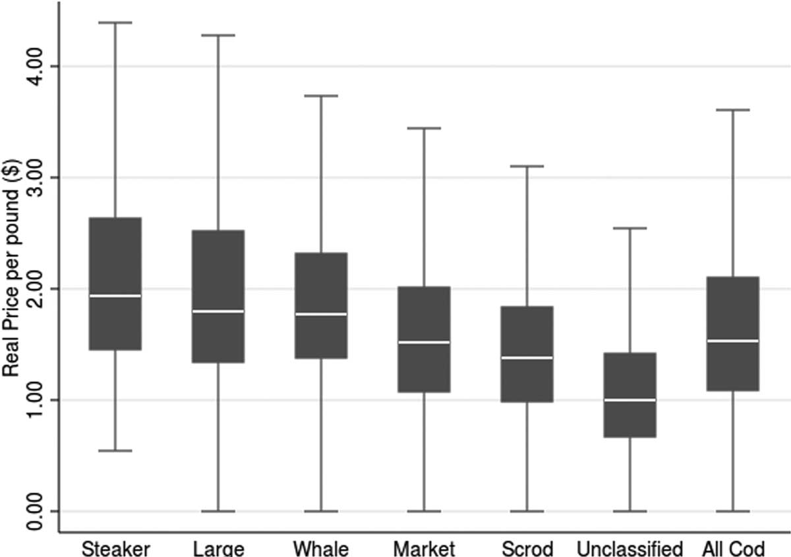
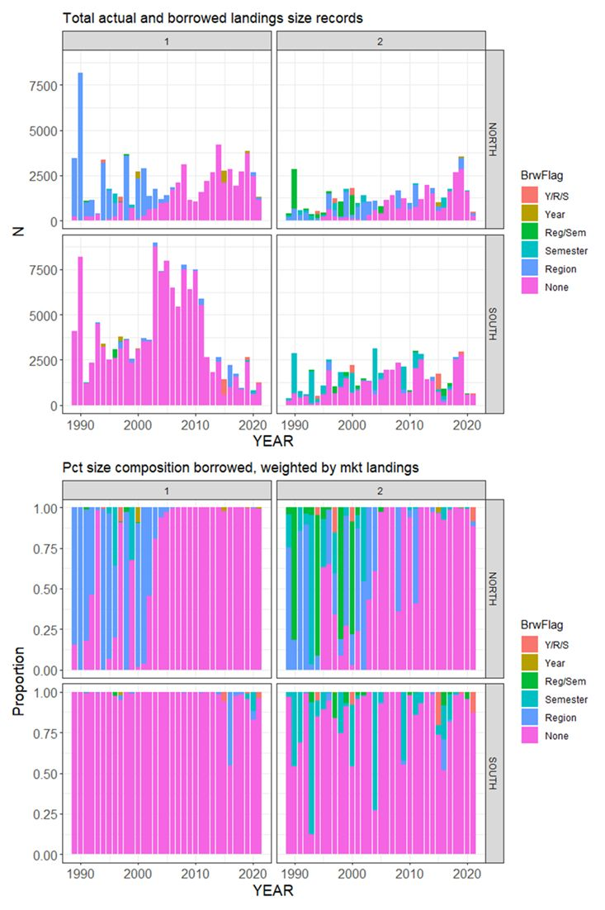

class: top, left

<style>
p.caption {
  font-size: 0.6em;
}
</style>

<style>
.reduced_opacity {
  opacity: 0.5;
}
</style>

```{r setup, include=FALSE}

options(htmltools.dir.version = FALSE)
knitr::opts_chunk$set(echo = F,
                      fig.retina = 3,
                      #fig.width = 4,
                      #fig.height = 2,
                      fig.asp = 0.45,
                      warning = F,
                      message = F)
#Plotting and data libraries
library(tidyverse)
library(here)
library(kableExtra)
library(DT)
library(widgetframe)

# if figure output defaults to docs/images/ replace with this before moving to 
# presentations/docs in both the html output (search and replace)
# and folder name
# 20220316_MAFMCSSC_Gaichas_files/figure-html/

imagefolder<-"2025_03_24_Economic_Informed_Stock_Assessments.Rmd"

```

```{r, load_refs,include=FALSE, cache=FALSE}
library(RefManageR)

BibOptions(check.entries = FALSE,
           bib.style = "authoryear",
           cite.style = "authoryear",
           longnamesfirst = FALSE,
           max.names = 1,
           style = "markdown")
myBib <- ReadBib("../../../../library.bib", check = FALSE)

# A large bib takes a while (10-20 seconds).
#,
#           hyperlink = FALSE,
#           dashed = FALSE

```

<!---
Use this to add a bottom note to a figure
.contrib[
Few managed species have binding limits; Management less likely playing a role
]

Use this to make a left list
.pull-left[

]

in-line cite with:  `r Cite(myBib, "carr2020expected")`
    + Contextual information
    + Report evolving since 2016
    + Fishery-relevant subset of full Ecosystem Status Reports

- Open science emphasis `r Cite(myBib, "bastille_improving_2020")`

- Used within Mid-Atlantic Fishery Management Council's Ecosystem Process `r Cite(myBib, "muffley_there_2020")`
 - Inline cite `r Citet(myBib, "muffley_there_2020")`


-->

# Research Question and Motivation

## Research Question
Can we use the information contained in fish prices to infer something useful about the size of the Mixed and Unclassified Black Sea Bass?

## Motivation

> Another source of uncertainty stemmed from the fact that no length information on individuals in the unclassified market category have been sampled since 2020. Calculating the catch at length for 2021-2023 necessitated borrowing information from before 2020 which introduces additional uncertainty. [BSB management track assessment report]


---
# Background
For years, economists have asked the opposite question: how much more do buyers pay for large fish compared to small fish? `r Cite(myBib, "McConnell2000")`


Scallops `r Cite(myBib, "Ardini2018")`are a nice example:


---
## Cod is another example

.pull-left[

]


.pull-right[

]

.footnote[
`r Cite(myBib, "Lee2014")`
]

---
# Methods

1. Do prices vary by size? (This is like a pre-test)
  - Estimate a hedonic model: the price per pound is a function of the transaction level attributes, like market category, gear, and time of year. 
  
2. Estimate a categorical model (ordered or un-ordered logit or something related) with price as an explanatory variable.  
  - Validate the model with a k-fold cross validation. 
  - Predict out of sample for the unclassified market category.
    
3.  Estimate a latent class (finite mixture model) on the price of unclassified, where there are a moderate number of classes (say small and large).  
  - Validate the model with a k-fold cross-validation.
  - Bonus validation: Validate the model by predicting categories for known small and large. 
  - Predict the class membership of the unclassified.  
  
4. Using the results of (1) or (2) reconstruct a new length distribution of the landed black sea bass.  

---

# Potential Pitfalls

- Data is such a bear.
  - But really, a major problem is that there is less QA/QC on the "value" columns. 
  - State-level aggregates.  There are rows in the dealer data that are state-level reports of sales by non-federal permits to non-federal dealers. 
    - If these are transactions (trip/subtrip), they can be assigned as long as the value reported is the true value, not an imputed one.  
    - If the transactions are aggregates, they *probably cannot* be assigned even if the true value reported. The fallacy of aggregation? 

- Price Separation: Prices need to vary by market category. 
  - No variation in prices across market categories, then it won't work
  - No need to assumed a particular price-size relationship
  - price-size relationship can change from year to year
  - Better if the price of ``Unclassified`` is between the price of two other categories.

- What if it's a dealer idiosyncrasy?


---
## Extensions

- Can we modify the way lengths have been borrowed?



- Can we apply these methods to other stocks?  Which stocks?
- If it works well, can port sampling effort be re-deployed away from categories that are hard to get?

---
## End Matter
.pull-left[
** Thank you to** 
- People
- Other People
]
.pull-right[
**Additional resources**
]

## References
.contrib[
```{r refs, echo=FALSE, results="asis", eval=TRUE}
PrintBibliography(myBib, .opts=list(max.names=3))
```
]

